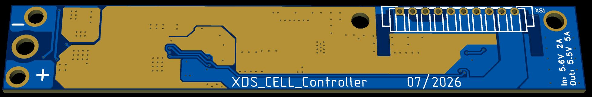
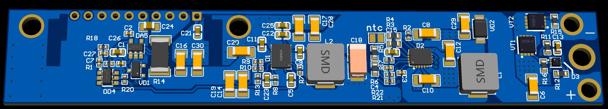
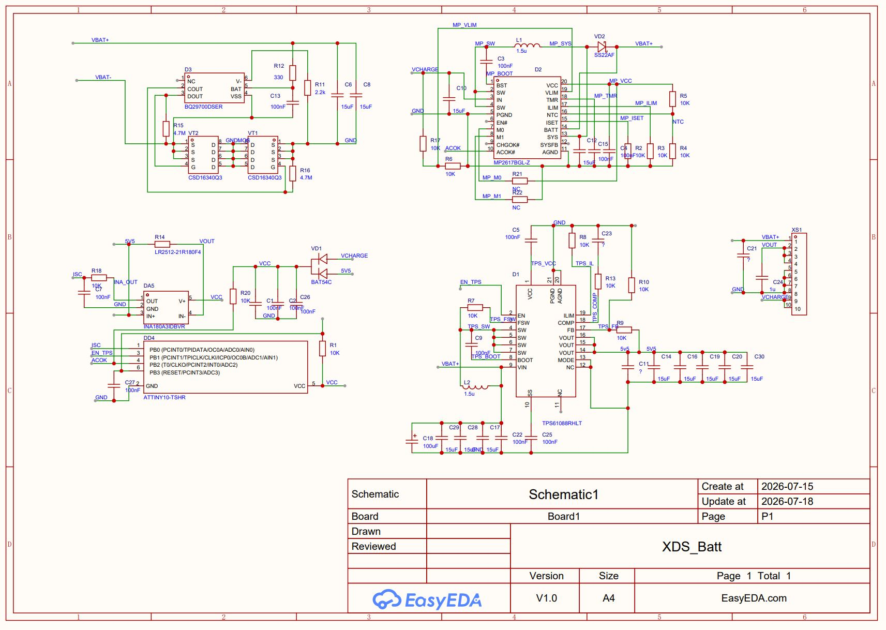
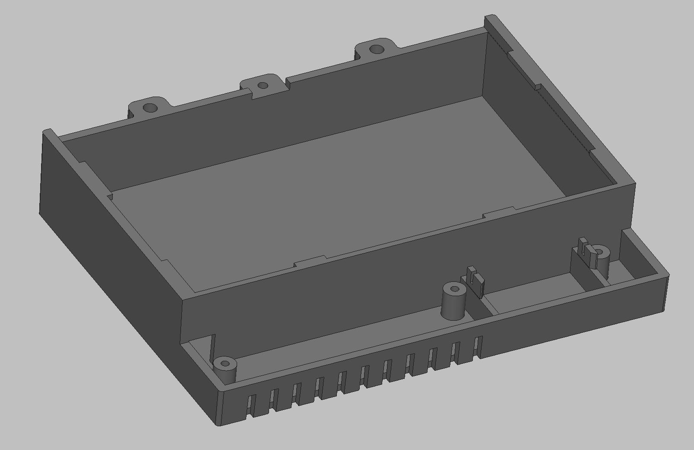
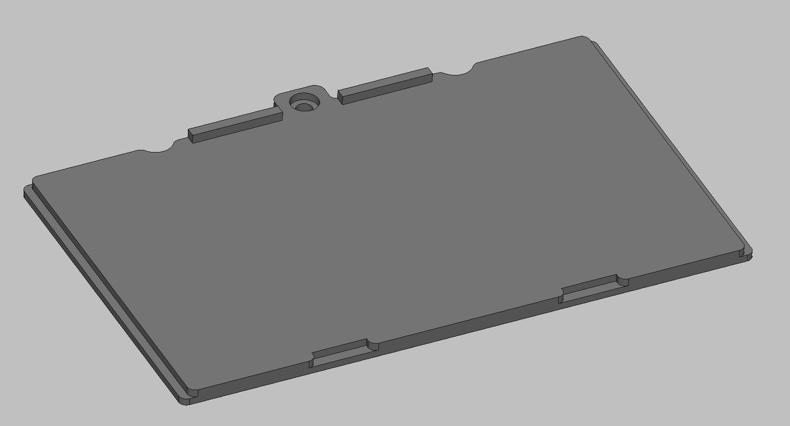

# XDS_Batt — аналог аккумуляторной батареи для осциллографа Owon XDS

Плата-замена штатной аккумуляторной сборки осциллографа Owon XDS: та же механическая компоновка и электрический интерфейс (10-контактный разъём), но с ёмкостью элементов увеличенной с ~2000 до 4000 мАч (Vapcell N40), удешевлённым контроллером заряда и собственной логикой автоматического отключения выходного преобразователя во время хранения — устраняет паразитный разряд оригинальной батареи (полная разрядка за 1-1.5 месяца даже при выключенном приборе).




Проект платы (EasyEDA/OSHWLab): [project_svjrqlut](https://oshwlab.com/mihaildenisov/project_svjrqlut) *(ссылка станет доступна после прохождения модерации)*

Gerber-файлы для заказа платы: [XDS_Batt_Controller.zip](XDS_Batt_Controller.zip)

## Совместимость

Батарея и разъём повторяют оригинальную механику и распиновку, поэтому применимы (под одним и тем же OEM-корпусом/платформой) к следующим сериям осциллографов:

| Бренд | Серии |
|---|---|
| OWON | XDS 30xx, 31xx, 32xx, 33xx |
| АКИП | 4122/(7-12) |
| АКТАКОМ | ADS 60xx, 61xx, 62xx, 63xx |
| VERDO | SB16xx |

## Основные характеристики

| Параметр | Значение |
|---|---|
| Аккумуляторная сборка | 1S6P, Li-Ion 18650, Vapcell N40 (4000 мАч/элемент) |
| Вход заряда | 5.6 В, до 2 А |
| Выход (питание осциллографа) | 5.5 В, до 5 А |
| Автоотключение при простое | ~48 часов без нагрузки и без заряда → перевод в транспортировочный режим |
| Интерфейс | 10-контактный разъём (совместим с оригинальной батареей) |

## Архитектура платы

Полная принципиальная схема — `XDS_Batt_files/XDS_Schematic.JPG`.



### 1. Защита батареи — BQ29700 + сдвоенные N-MOSFET
Классическая схема защиты Li-Ion сборки: **BQ29700DSER** (D3) управляет двумя сдвоенными N-канальными ключами **CSD16340Q3** (VT1, VT2), включёнными последовательно в цепь VBAT- для отключения при перезаряде/переразряде/КЗ. Независима от остальной электроники платы — работает даже при полностью обесточенном контроллере.

### 2. Зарядное устройство — MP2617B
**MP2617BGL-Z** — импульсный зарядчик с автоматическим power path management:
- Входной ток ограничен ~2 А (Default Mode: M0/M1 не задействованы — R21/R22 не запаяны, что соответствует плавающим входам и заводскому лимиту тока без внешнего резистора ILIM);
- Входное напряжение ограничивается делителем на VLIM (R2-R4) — защита сетевого адаптера от просадки при перегрузке;
- Ток заряда задаётся резистором на ISET;
- Таймер безопасности — конденсатором на TMR;
- NTC-вход подключён (термоконтроль элементов при заряде);
- Статусные выходы CHGOK#/ACOK# используются платой контроллера (ACOK# — индикация наличия входного напряжения заряда для алгоритма автоотключения, см. ниже).

Выход SYS не используется как отдельная системная шина — питание повышающего преобразователя (TPS61088) берётся напрямую с VBAT+, в обход SYS, так как MP2617B не рассчитан на токи, необходимые TPS61088.

### 3. Повышающий преобразователь — TPS61088
**TPS61088RHLT** — buck-boost/boost преобразователь, формирующий выходные 5.5 В из напряжения батареи (3.0-4.2 В) для питания осциллографа. Включается/выключается по входу EN, управляемому контроллером на ATtiny10 (см. ниже) — это ключевое отличие от оригинальной батареи, где аналогичная микросхема работала постоянно и разряжала сборку даже при выключенном приборе.

### 4. Контроллер простоя — ATtiny10 + INA180A3
Узел, устраняющий паразитный разряд:

- **INA180A3IDBVR** (DA5) измеряет ток в цепи выходных 5.5 В через шунт **R14**, усиленный сигнал через RC-фильтр подаётся на вход АЦП ATtiny10 (PB0/ADC0).
- **ATtiny10** (DD4) также принимает сигнал ACOK# от зарядного устройства (PB2) и управляет входом EN преобразователя TPS61088 (PB1).
- Питание контроллера и датчика тока — через диодную сборку **BAT54C** (VD1) от входа заряда (VCHARGE) и от выхода (5V5/VOUT) — работает при наличии любого из двух источников.

**Алгоритм** (реализация — прошивка ATtiny10, Atmel Studio / avr-gcc; исходники — [ATtiny10_XDS_Power](https://github.com/MihailDenisov/XSD_Battery/tree/main/ATtiny10_XDS_Power)):
1. При появлении напряжения на входе заряда МК запускает TPS61088 (EN=1) и переходит в цикл сна с пробуждением по Watchdog каждые 8 секунд.
2. При каждом пробуждении проверяется: (а) наличие сигнала ACOK# (заряд подключён), (б) ток нагрузки выше порога (~500 мА — прибор включён).
3. Если оба условия отсутствуют — инкремент счётчика простоя; при наличии любого из них — сброс счётчика.
4. По достижении счётчиком значения, соответствующего ~48 часам непрерывного простоя, контроллер отключает TPS61088 (EN=0), обесточивая тем самым себя, датчик тока и электронику осциллографа — плата переходит в режим хранения с минимальным током утечки.
5. Выход из режима хранения — только через повторное подключение к сетевому адаптеру (появление напряжения на входе заряда).

## Разъём XS1 (совместим с оригинальной батареей)

| Контакт(ы) | Назначение |
|---|---|
| 1 | Выход для контроля уровня заряда прибором |
| 2, 3, 4 | Выход преобразователя, питание прибора 5.5 В |
| 5, 6, 7, 8 | Общий минус (GND) |
| 9, 10 | Вход от блока питания прибора для заряда |

Схема — `XDS_Batt_files/XDS_Schematic.JPG` (XS1).

## Корпус (3D-модель для печати)

Корпус состоит из двух частей: основание и крышка-слайдер (вставляется по пазам, фиксируется 1 винтом).




3D-модели в формате STEP:
- `Casing/xdsbattcase.stp` — основание корпуса
- `Casing/xdsbatttop.stp` — крышка-слайдер

Крепёж:
- Крышка к основанию — 1 винт.
- Плата к корпусу — 3 винта с конической шляпкой.
- Батарея (в сборе) к осциллографу — 2 винта.

Точные размеры (диаметр, длина, шаг резьбы) всех винтов будут измерены и указаны позже.

## Статус проекта / открытые вопросы

- [ ] Калибровка порога тока (500 мА) под реально измеренное потребление осциллографа во включённом/выключенном состоянии.
- [ ] Проверка активного уровня и логики ACOK# на смонтированной плате.
- [ ] Тепловые измерения MP2617B на реальном прототипе (расчётный запас по Tj при токе заряда ~2.76 А — умеренный, требует подтверждения на закрытом корпусе осциллографа).
- [ ] Финальная проверка прошивки ATtiny10 на реальном железе (в репозитории нет возможности прогнать сборку через avr-gcc/Atmel Studio при подготовке этого README).
- [ ] 3D-модель корпуса (см. раздел «Корпус» выше) — черновой вариант готов, требуется проверка посадки платы, разъёма и отверстий по месту, пробная печать.
- [ ] Схема имеет черновой вид (номиналы части компонентов не финализированы) — требуется обязательная доработка и проверка перед формированием точного BOM.

## Структура репозитория

```
/XDS_Batt_files/              — изображения платы, схемы и корпуса (используются в этом README)
  XDS_PCB_Top.JPG
  XDS_PCB_bottom.JPG
  XDS_Schematic.JPG
  3dcase.jpg
  3dtop.jpg
/ATtiny10_XDS_Power/          — прошивка ATtiny10 (Atmel Studio / avr-gcc проект)
/Casing/                      — 3D-модели корпуса (STEP)
  xdsbattcase.stp
  xdsbatttop.stp
XDS_Batt_Controller.zip       — Gerber-файлы платы
README.md
```

Исходники прошивки: [ATtiny10_XDS_Power](https://github.com/MihailDenisov/XSD_Battery/tree/main/ATtiny10_XDS_Power)

## Предупреждение по технике безопасности

Проект связан с разработкой платы заряда/защиты Li-Ion аккумуляторной сборки большой ёмкости (~86 Вт·ч). Любые изменения номиналов, схемотехники защиты (BQ29700) или зарядного тракта должны проверяться пересчётом и тестироваться с осторожностью (ограничение тока на первом включении, термоконтроль, изолированная зона тестирования). Автор(ы) не несут ответственности за повреждение оборудования или травмы при повторении конструкции.
